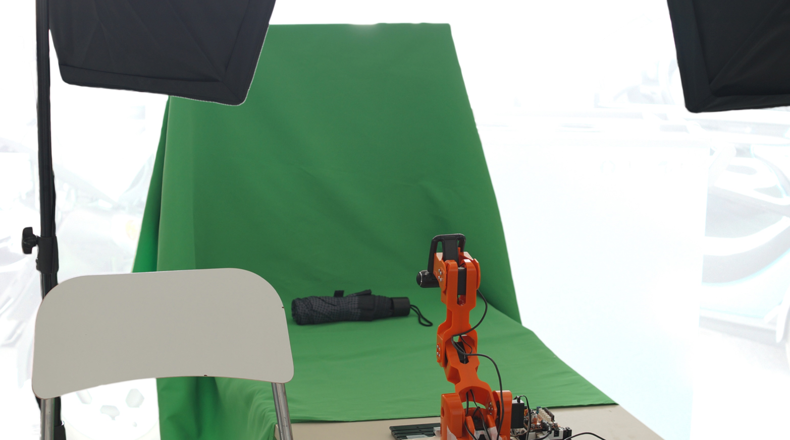
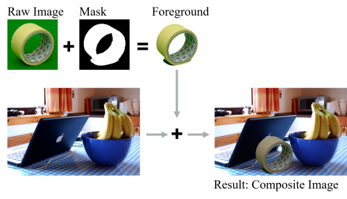

# Image-Bot

A low-cost, low-effort setup to generate large synthetic dataset for object recognition and image segmentation from real-world objects

&nbsp;  

&nbsp;  

This repository contains the source code for the Image-Bot. The Image-Bot is low-cost, low-effort physical setup and software pipeline to generate large synthetic dataset for object recognition and image segmentation from real-world objects. It uses a common technique from the movie industry: Pictures of objects are taken in front of a green screen from different perspectives. The green parts of the pictures are removed (so-called chroma keying) and the objects are inserted into random backgrounds to generate the dataset. Labeling happens automatically through the object's mask.

&nbsp;  

*Background image from [COCO 2017 dataset](https://cocodataset.org/)*

&nbsp;  

Core idea of the Image-Bot is to enable small and medium-sized companies to use machine learning approaches. It should support them in building their own training datasets. Training datasets for image recognition are often poorly available for small and medium-sized manufacturing companies, due to the highly specialized products they work with, and the disproportionate investment to generate their own ones. The Image-Bot creates a dataset of about 1,500 to 3,000 labeled training images in under 45 min from real-world objects while using affordable hardware (total cost less than 500 €).

A scientific paper describing the Image-Bot approach in more detail will be available soon.

## Getting Started

The Image-Bot was tested with Microsoft Windows 10 and Ubuntu 20.04 LTS. Support for other Linux distributions and MacOS is planned.

### Usage and Disclaimer

Please be carefull when following the instructions and when operating the setup.

DISCLAIMER We are not responsible for any harm caused by our proposed setup. Please be sure and know what you are doing before following this setup guide and operating the Image-Bot. While physical damage is not probable due to the low torque of the robot and the low voltage of the components, it cannot be excluded. The same holds for loss of data and other damages caused to yourself, your physical and virtual setup. Please also have a look the [License File](LICENSE) for further information about warranty, disclaimers etc.

### Hardware Setup

The Image-Bot relies on a specific physical setup to capture the images of the real-world objects. Total cost of the setup is less than 500 €. The physical setup is described in the [Hardware Setup Guide](doc/HardwareSetup.md).
We do not receive any compensation from the vendors of the components used in the setup. As such, suggestions for cheaper or better-to-use setups are always welcome.

If you only want to test the Image-Bot without setting up any hardware, please have a look at our datasets. They provide you with some exemplary images, captured with our Image-Bot setup.

* [Everyday/Industrial Objects](https://doi.org/10.17632/4nn2w8rvx3.1)
* *More datasets will follow soon...*

You can process these datasets further with the Image-Bot's software pipeline.

### Software Setup

The Image-Bot comes with a ready-to-use software pipeline (available in this repository) to process the images, captured with the physical setup. To setup the software pipeline, please refer to the [Software Setup Guide](doc/SoftwareSetup.md).

### Usage

Once setup, the Image-Bot is easy- and straight-forward to use, as well as low-effort. Please have a brief look at the [User Manual](doc/UserManual.md) to learn, how to operate the Image-Bot.

## Further reading

This project relies on different submodules and previous works. We especially want to mention the following:

* We use Poisson Image Editing to blend the foreground with the background images. This new application of Poisson Image Editing leads to a very stable and robust chroma keying approach. Therby, we use the algorithms from the paper *Pérez, P., Gangnet, M., Blake, A., 2003. Poisson image editing. ACM Trans. Graph. 22, p. 313.* provided [here](https://github.com/PPPW/poisson-image-editing).
* Furthermore, we use [ImgAug](https://github.com/aleju/imgaug) for image augmentation.
* The Software for the Braccio Robot Arm is available [here](https://github.com/MobilityInnovation/BraccioController).
* We tested the Image-Bot by training a YOLOv5 neural network for object recognition and gained good results. Thus, the Image-Bot natively supports generating training datasets in the Yolo-Format. However, datasets for other algorithms can easily be generated by adapting the code of the last processing step of the Image-Bot.
For further information about YOLOv5 you can have a look at the [YOLOv5 Repository](https://github.com/ultralytics/yolov5).

## License

Distributed under MIT license. See `LICENSE` for more information.

## Contact & Maintainer

* Lukas Block - <lukas.block@iat.uni-stuttgart.de>
* Adrian Raiser - <adrian.raiser@iao.fraunhofer.de>

## Project

* Image-Bot on Github: <https://github.com/MobilityInnovation/Image-Bot>
* Morphoa-Project: <https://www.photonikforschung.de/projekte/open-innovation/projekt/morphoa.html>

## Acknowledgements

The Image-Bot is part of the research project Morphoa, funded by the German Federal Ministry of Education and Research (BMBF).

## Next steps

* Fix minor bugs and clean up code
* Enhance useability
* Write installation scripts for Windows and Ubuntu
* Put it in a docker container
* Extend for 3D images
* Fully automate the process
* Populate init-files of the subpackages?
* Add the Poisson editing and ImgAug as a real submodule
