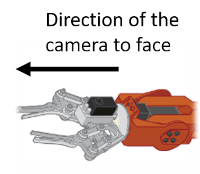
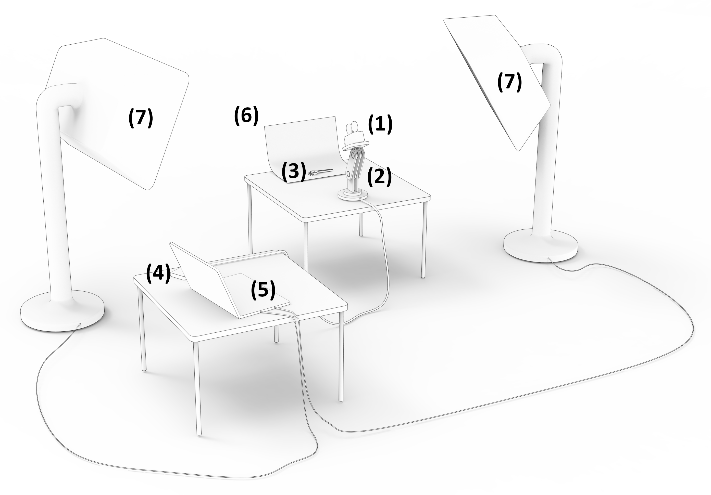

# Physical setup of the Image-Bot

[Go back to main page](../README.md)

## Parts list

* 1x Arduino Uno Rev 3 (see [here](https://store.arduino.cc/arduino-uno-rev3))
* 1x Braccio Robot Arm (see [here](https://store.arduino.cc/tinkerkit-braccio-robot))
* 1x USB-Webcam
* 2x Softboxes for lighting (e.g. [these](https://www.walimex-online.de/studiofotografie/dauerlicht/daylight/walimex-pro-daylight-250-2er-set-softbox-stativ) or similiar ones)
* 1x Green Screen Curtain
* 1x Personal computer with Windows 10 or Ubuntu to control image capturing and processing
* 1x USB-A to USB-C cable, to connect the Arduino with your personal computer
* Something over which the green screen can be hung
* Some extension cords for power supply might be necessary

## Assembly of the Braccio Robot Arm

Assemble the Braccio Robot Arm as described in its manual. Do not mount the grippers, but put the camera there instead (e.g. with cable ties). The camera must face the same direction as the grippers normally would.



Connect the Braccio Robot Arm with the Arduino Uno as described in the Braccio's manual.

## Flash the Arduino

Download Arduino Studio (see [here](https://www.arduino.cc/en/software)) to your computer and install the software. Arduino Studio is required to flash the Arduino once in the beginning. Afterwards you can get rid of the software. If you are already familiar with Arduinos and use another IDE, feel free to do so.

Download or ```git clone``` the software from ```https://github.com/MobilityInnovation/BraccioController.git```. It contains all the necessary functionality for the Braccio Robot Arm to be used by the Image-Bot's software pipeline.

If you downloaded the software as a *.zip-File, unzip it to some suitable path on your harddrive. Open your (git) terminal there and load the git submodules via the following command:

```(bash)
git submodule init

git submodule update
```

*For more Information on how to use git see the [Software Setup Guide](SoftwareSetup.md)*

Open the "BraccioController.ino" contained in the cloned folder with Arduino Studio. Connect the Arduino Uno to your computer via the USB-A to USB-C cable.

Flash the software to your Arduino Uno by clicking on the arrow in the upper left corner of Android Studio.


Uninstall Arduino Studio, if you want to and don't need it for any further projects. From here on, it is not necessary for the Image-Bot anymore.

## Final setup

Finally, place and connect the physical setup as shown in the image below.



The physical setup consists of the camera (1), mounted on top of the robot (2) to move it vertically around the object (3). The Arduino Uno Rev3 (4) controls the robot and is connected to the personal computer (5) with the USB cable. The personal computer performs the image capturing and processing tasks. Furthermore, the green curtain is attached to its support structure (6). Lighting should happen through the two soft boxes (7) and be as uniform as possible without casting shadows on the green curtain underneath or behind.

Afterwards your setup should look similiar to the following picture.


If everything is setup properly, proceed with the [Software Setup Guide](SoftwareSetup.md).
