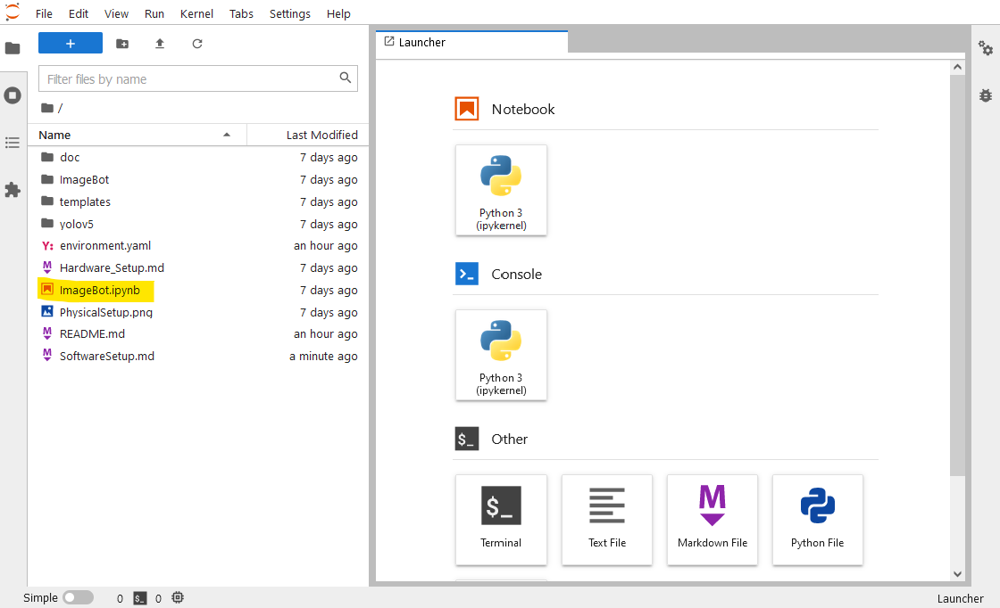
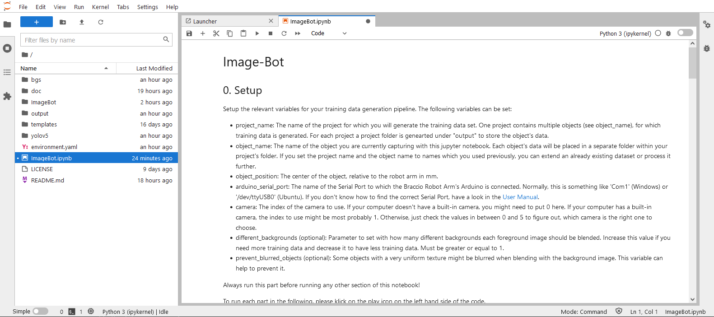
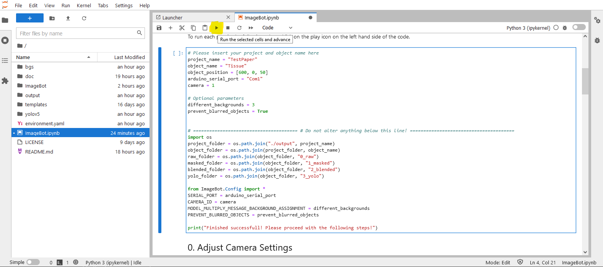

# User Manual of the Image-Bot

[Go back to main page](../README.md)

## 1. Start the Image-Bot

Go to the main "image-bot" folder. Open a (global) terminal and type:

```(bash)
jupyter lab
```

Your browser should open and display something similiar to the following image:



Double click on "ImageBot.ipynb".  
Now, select the right kernel (image-bot-kernel) in the upper-right corner.

The Image-Bot is now ready to be used! Just follow the instructions on screen and/or continue reading this manual.

## 2. Overview of the Image-Bot steps

The Image-Bot consists of five general steps to take:

0. Setup: Define the name of the project and the object you want to scan. Furthermore setup basic information like the camera to use and the connection to the Arduino. For Microsoft Windows Users, some camera settings (e.g. Whitebalance) can be defined.
1. Data aquisition: Using the Braccio Robot Arm, the Image-Bot creates sequences of images for the desired object. To achieve best results, multiple sequences using multiple angles of the object are required.
2. Greenscreen Removal: Removal of the greenscreen happens via an easy-to-use GUI. The Image-Bot operator must select a suitable green value.
3. Image Blending: The objects are blended with background images, randomly selected from the "bgs" directory. The training images + the masks are created.
4. Convert to YOLO dataset: Converts the training images and their masks to a suitable YOLO training and test dataset. Skip this step or reprogram the algorithm if you need other outputs.

Each step is described in detail in the "ImageBot.ipynb" in your browser. You can always stop your process in between each step and resume it later on. For detailed information about each step, have a look at the "ImageBot.ipynb" in your browser.

The results of each step are stored in the "output" folder.

## 3. Using the Image-Bot

After opening "ImageBot.ipynb" in your browser, you should see somthing similiar to the following picture.



Each step in the Image-Bot consists of an introduction an then a cell to run the step. After reading everything which is written in the step's introduction (in this case everything underneath "0. Setup"), scroll down, until you see a code block.

If necessary, change something in the code block; the step's introduction will tell you so, if it is necessary. Afterwards, let the code block run, by clicking in the code block and then on the "Play" icon in the main menu bar.



The step's progress and output is displayed underneath the code block. After the code block is fully processed you can proceed with the next step.

## 4. Arduino Connection Setup

In the "0. Setup"-Step you are required to set the serial port for communication to the Arduino. The Arduino is physically connected via USB. Yet, we need to define the serial port for the communication to work. You can figure out the serial port as follows:

* **Windows:** Open the device manager and search for *Ports (COM & LPT)*. Expand the entry and look for *Arduino Uno (COM?)*. Copy the value inside the parenthesis and paste it into the variable *arduino_serial_port = "COM?"*  within the "0. Setup"-Step in your "ImageBot.ipynb" in the browser.
* **Linux:** Open a terminal an type ```dmesg | grep tty```. This lists all tty devices detected by the kernel. One of them is the Arduino. Paste it into the variable *arduino_serial_port = "COM?"*  within the "0. Setup"-Step in your "ImageBot.ipynb" in the browser.

## 5. Close the Image-Bot

In your "ImageBot.ipynb" in the browser click on *File > Close and Halt* or *File > Shutdown*, when you are done. Close the Browser Tab or Window in which the Image-Bot was shown. Return to your (global) terminal. Hit Ctrl+C here to stop the Image-Bot.

Then close the terminal.

## Fine Tuning the Image-Bot

You can already set the most important parameters for the Image-Bot in the "ImageBot.ipynb" in your browser. However, if you want to fine tune the algorithms, e.g. because you have a hard to capture image, have a look at the Config file in ImageBot/Config.py.
